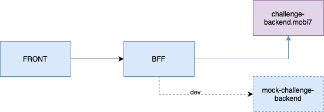

# poi-application
Preparativo para Code Interview

## 1.Desafio
Construir uma solução com as seguintes funcionalidades:
* Uma página web que exibirá numa tabela a quantidade de tempo em que os veículos passaram dentro de cada POI;
* Usuário poderá filtrar por data e placa do veículo;

## 2.Arquitetura da Solução



Para fins de apresentação de dominio das habilidades da vaga, tomei a liberdade de extender a solução adicionando uma arquitetura com uma aplicação apenas para front-end e uma para funcionar como um backend for front-end (BFF), além disso, para evitar ter que recorrer o tempo todo a api externa, fiz a criação de um mock com os dados retornados para fazer os testes integrados localmente sem precisar conectar o tempo todo com o serviço externo.

## 3.Recursos utilizados

* Para o FRONT da solução foi escolhido o Angular na versão 18 (mais recente na data 24/06/2024), com uso também de componentes do material design como tabela e formulário.
* No BFF foi utilizado o NestJs na versão 10. Utilizado também pequenos recursos como o moment para lidar com intervalos de data de forma mais simples.
* No mock, fiz a criação simplificada de uma API usando GOLANG apenas para retornar dados em JSON.

Não foi implementado nenhum tipo de autenticação de serviços essa etapa.

## 4.Como executar

Tanto para o Front quanto o BFF deve ser feito a instalação de dependências do Node com o seguinte comando dentro das pastas bff-web e web-front:
```
npm install
```

Em seguinda na posta do projeto de front (web-front) deve ser executado o comando abaixo:
```
npm run start
```

No caso do projeto bff-front, ele tem duas configurações, uma de dev e uma padrão (de entrega), a de dev consome os endpoints no projeto mock, ele deverá estar sendo executado para o projeto funcionar, caso rode sem a flag 'dev', será consumido os endpoints do desafio fornecidos originalmente.
- Para execução em dev, basta executar com a flag dev da seguinte forma:
```
npm run start:dev
``` 
- Para execução padrão, basta executar da seguinte forma:
```
npm run start
```

O projeto do front será executado na posta 4200 e o de bff será executado na porta 3000. Ambas as portas devem estar livres para o projeto executar conforme esperado.

Finalmente, basta acessar no navegador:
```
http://localhost:4200
```

## 5. Documentação da API
O bff-web teve seus endpoints mapeados para documentação com OpenAPI( swagger) o acesso se dá pelo endereço:
https://localhost:3000/api